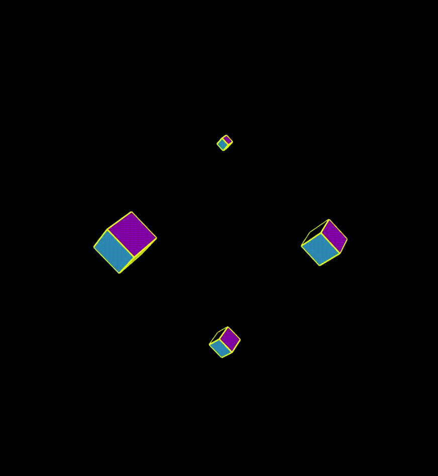

# 3D Rotataing Cube P5.JS

- push()
- translate(x,y)
- rotateX(n)
- rotateY(n)
- rotateZ(n)
- box(n)
- pop()

- normalMaterial() Normal material for geometry is a material that is not affected by light. It is not reflective and is a placeholder material often used for debugging. Surfaces facing the X-axis, become RED, those facing the Y-axis, become GREEN and those facing the Z-axis, become BLUE. 

- variable (random(x,y)) rotating speed on each pass

